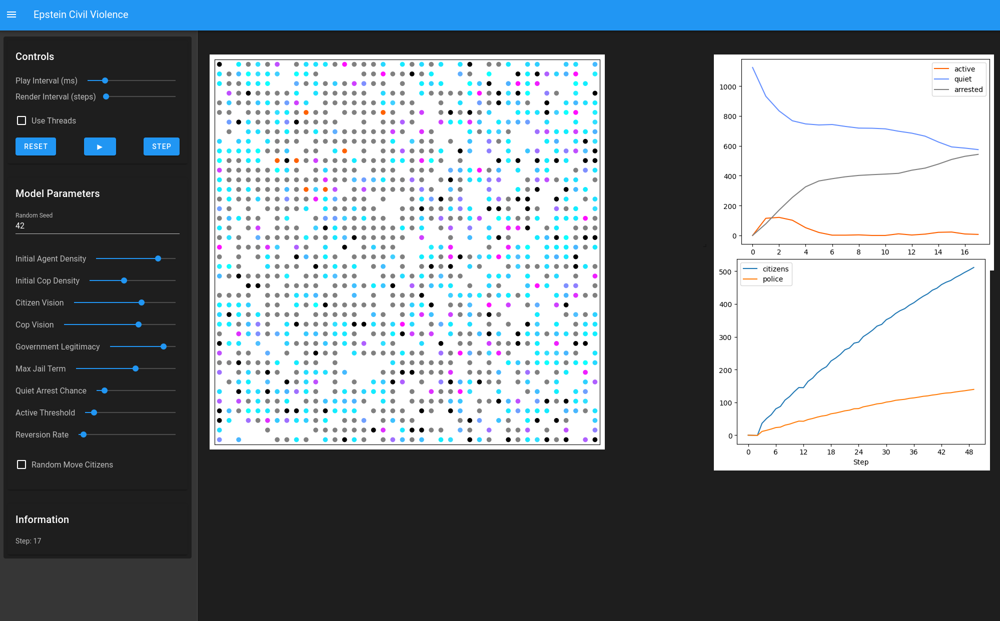

# Spatial Epstein Civil Violence



This is a modification to Epsteins civil violence agent based model. Our modified model can be found in

```
mesa/examples/advanced/epstein_civil_violence
```

# Usage

Below are a few ways to run the model. For more ways of running mesa models, such as Docker containers, see the [mesa repository](https://github.com/projectmesa/mesa).

## Conda

Create a conda environment with the needed dependencies:

```bash
conda env create -f requirements.txt -n <name-of-env>
conda activate <name-of-env>
```

This also works with other conda-based environment managers, such as (micro)mamba.

## uv

This repository contains a `pyproject.toml` and `uv.lock` file. An uv virtual environment can be created with

```bash
uv sync
```

Any scripts can be run with

```bash
uv run mesa/examples/advanced/epstein_civil_violence/parameter-estimation/test.py
```

## Interactive viewer

The model can be displayed using solara. To open the interactive viewer, run

```bash
solara run mesa/examples/advanced/epstein_civil_violence/app.py
```

This should start solara in a new tab in the browser. This also works with uv:

```bash
uv run solara run mesa/examples/advanced/epstein_civil_violence/app.py
```

# Repo index

The files for the model are found in
- model.py
- agents.py

Global sensitivity analysis files are found in the `parameter-estimation` folder. Read the local README for details. The important files here are
- constants.py
- generate_parameters.ipynb
- measure_sensitivity.ipynb
- GSA-anaysis.ipynb

Ripley analysis files are also found in the `parameter-estimation` folder. Read the local README for details. The important files here are
- ripley.py
- run.py
